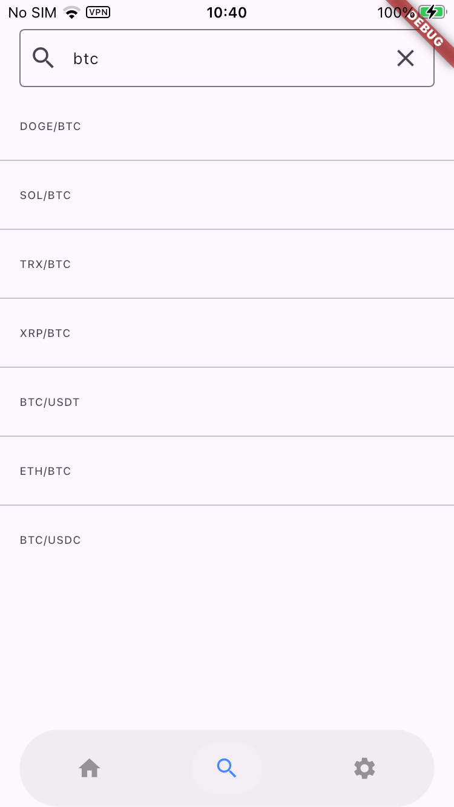

# dcex

A **crypto exchange aggregation preview project** built with **Flutter** and **CCXT**.

This project focuses on providing a unified market overview across multiple cryptocurrency exchanges, including real-time ticker data, market lists, and trend visualization.

> ⚠️ **Status**: Work in Progress  
> The project is under active development and not yet feature-complete.

## Overview

- 📱 **Frontend**: Flutter  
- 🌐 **Backend**: CCXT-based service (WebSocket + REST)
- 🔄 **Data**: Aggregated market data from multiple exchanges
- 📊 **Goal**: Provide a clean, real-time preview of crypto market trends across exchanges

## Environment Details

- Flutter SDK Version: 3.38.5+  
- Dart Version: 3.10.0+  
- Riverpod Version: 3.0.0+

## Current Status

- Core architecture is in place
- WebSocket-based market updates are under development
- State management and data flow are being actively refined
- UI and feature set are **not final**

Expect breaking changes during development.

## Screenshots

Here are some screenshots of the main pages of the app:

## Running the Project

This repository **only contains the Flutter client**.

To run the app successfully, you also need to set up and run the backend service.

👉 Backend repository (required):  
**https://github.com/aipinn/dcex_server.git**

Make sure the backend service is running before launching the Flutter app.

## Tech Stack

- **Flutter**
- **Riverpod3.0+**
- **WebSocket**
- **CCXT**
- **REST APIs**

## Notes

- This project is intended for learning, experimentation, and future expansion.
- It is **not** intended for trading or financial decision-making at this stage.

## License

MIT