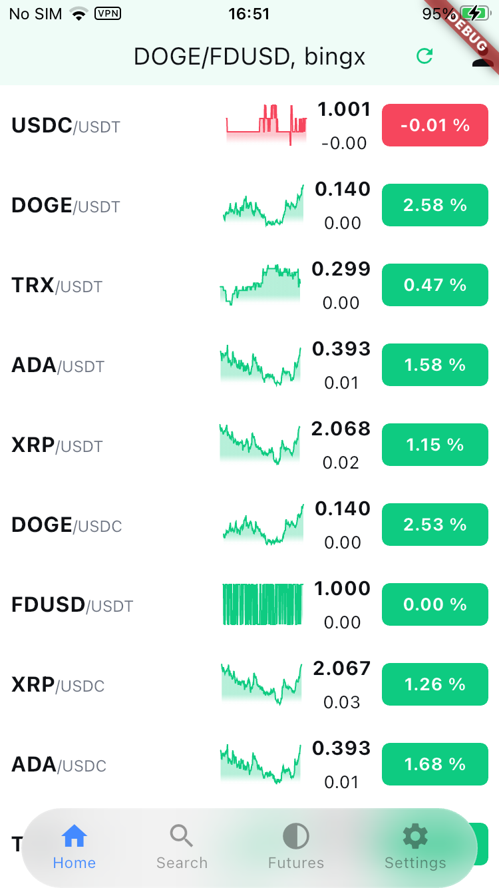
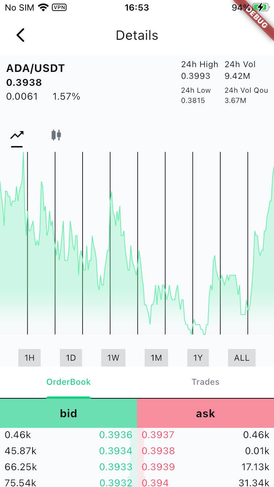
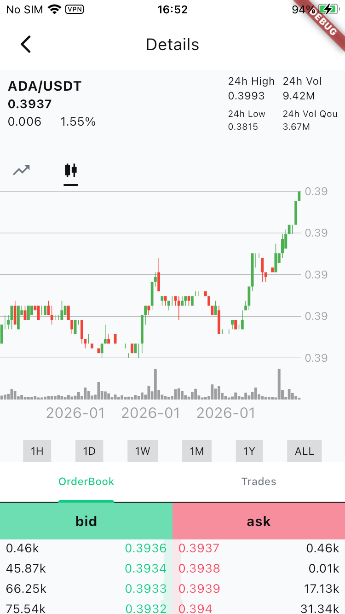
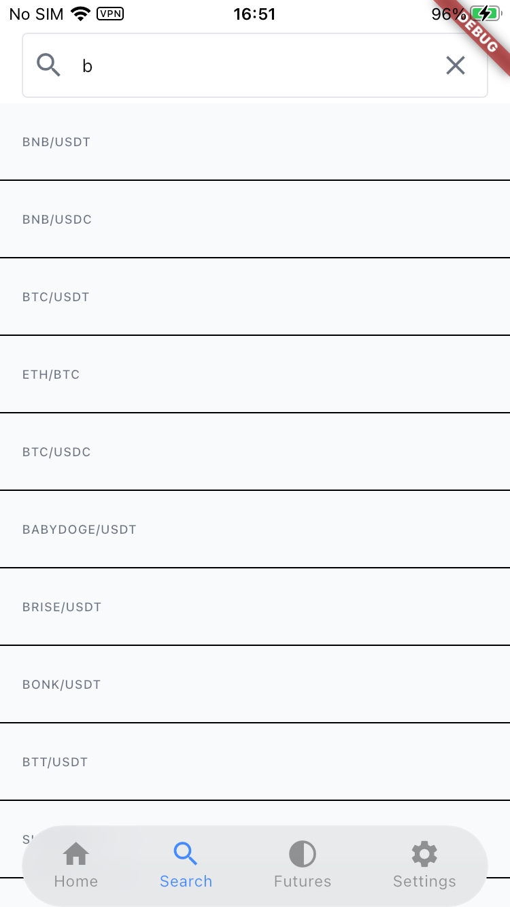
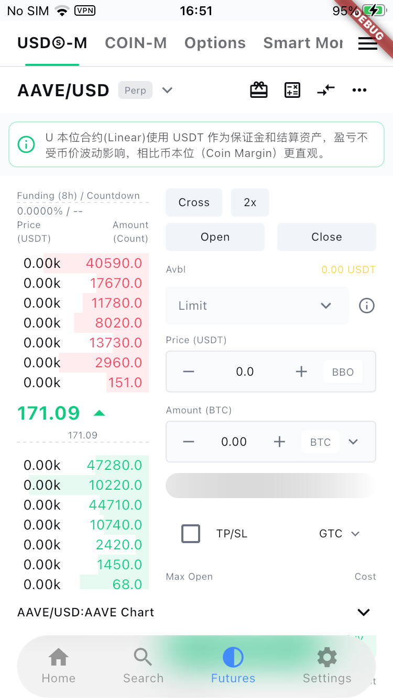
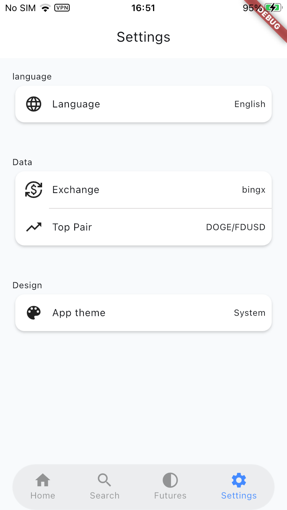
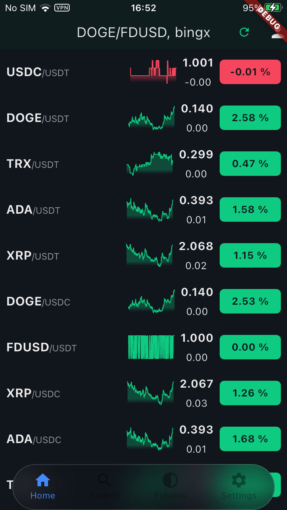

# dcex

一个基于 **Flutter** 和 **CCXT** 构建的 **加密货币交易所聚合预览项目**。

该项目旨在对接多个主流加密货币交易所，提供统一的行情视图，包括实时 Ticker 数据、市场列表以及趋势展示能力。

> ⚠️ **项目状态**：开发中  
> 当前仍处于持续迭代阶段，功能和结构可能会发生较大变化。

## 项目概览

- 📱 **前端**：Flutter  
- 🌐 **后端**：基于 CCXT 的服务（WebSocket + REST）
- 🔄 **数据来源**：多交易所聚合行情数据
- 📊 **目标**：提供一个干净、实时的多交易所行情预览工具

## 开发环境

- Flutter SDK：3.38.5+  
- Dart SDK：3.10.0+  
- Riverpod：3.0.0+

## 当前进度

- 核心架构已完成
- 基于 WebSocket 的行情推送正在开发中
- 状态管理与数据流方案持续优化
- UI 与功能设计 **尚未最终确定**

在开发过程中可能会存在破坏性变更。

## 应用截图

以下是应用部分页面的截图示例：

      

## 运行项目

当前仓库 **仅包含 Flutter 客户端代码**。

要完整运行该项目，你还需要单独部署并运行后端服务。

👉 后端仓库（必需）：  
**https://github.com/aipinn/dcex_server.git**

请确保后端服务已启动后，再运行 Flutter 客户端。

## 技术栈

- **Flutter**
- **Riverpod 3.0+**
- **WebSocket**
- **CCXT**
- **REST API**

## 说明

- 本项目主要用于学习、实验以及后续扩展
- 当前阶段 **不适用于真实交易或任何金融决策**

## 开源协议

MIT
